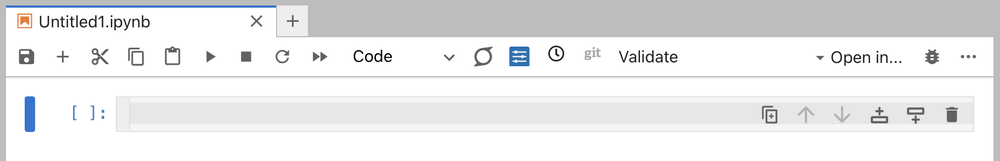
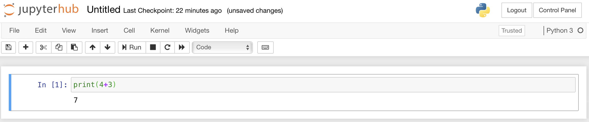

# The Jupyter Notebook interface

## Interface elements

There are a few sections of the Notebook interface that will be useful to know your way around:

**The notebook tab**: This shows your notebook filename (e.g., `Untitled1.ipynb`). You can have multiple notebooks open in different tabs. You can rename your notebook by right-clicking on the tab and selecting `Rename Notebook…`. When you create a new notebook, it will be called `Untitled<N>.ipynb`. It is good practice to rename your notebooks when you create them so that you can more easily find them again later.

**The notebook toolbar**: Contains the most commonly used actions:
- 💾 Save notebook
- \+ Add a new cell below
- ✂️  Cut selected cells
- 📋 Copy and paste cells
- ▶️  Run the current cell
- ⏹️ Interrupt the kernel
- 🔄 Restart the kernel
- `Code ▼` Cell type selector (change between Code, Markdown, and Raw)

**The cell**: Below the toolbar is a "cell". This is where you type your Python code. A notebook can have multiple cells, which allows you to organise your code into components.

## Cells

The body of the notebook is made up of **input cells**. When you open a new notebook it will contain only one empty cell; this is the grey box with `In [  ]:` to the left. 

There are three types of input cells where you can add content to a notebook.

### Code cells

**Code cells** are the default cell type in a notebook.
A **code cell** can accept code, that can then be executed (run). 
When the code in a code cell is run, the notebook displays any output generated by that code directly below the corresponding cell.

In the figure above, the code cell has the Python code `print(4+3)` entered.
This cell has then been run, which executes (runs) the code in the cell: in this instance we add 4 and 3, and print the result.

### Markdown cells

A **markdown cell** contains text formatted using [Markdown](https://www.markdownguide.org/basic-syntax/), which is a lightweight markup language that can be used for writing formatte text. 
When a **markdown cell** is run, the markdown is converted into HTML, with the formatted text then shown _in place_ of the cell.
**Markdown cells** can be used to include formatted text, mathetmatical equations, images, tables, and more types of rich media.

This figure shows a markdown cell being edited, with raw markdown entered.

This figure shows the same cell after it has been run, with the markdown converted to formatted text.

### Raw cells
Input entered into **Raw cells** is not converted when the cell is run. These cells are usually used to provide additional information for converting Jupyter Notebooks to a different format (e.g., a PDF document). You almost certainly will not need to use **Raw cells** during this course, but might be curious about this third cell type.

### Switching cell type.
Cells can be switched between **code** and **markdown** using the `Code ▼` menubar option.

You can also switch between cell types in **commmand mode** (see below) using the keyboard shortcuts `Y` for **code**, `M` for **markdown**, and `R` for **raw**.

### Active cells

A cell is marked as **active** if it is highlighted. The colour of the highlight depends on whether you are in **command mode** or **edit mode**

#### Command mode

**Command mode** is indicated by a blue highlight. When you are in command mode you can use **keyboard shortcuts** to cut, paste, and move cells, etc. You can see all the **keyboard shortcuts** under `Help` &#8594; `Keyboard Shortcuts`.

#### Edit mode

If you are in **command mode** then pressing `Enter` or clicking in the input text area of a cell will switch you to **edit mode**. **Edit mode** is indicated by a green highlight, and a pencil icon in the top right of the Notebook window.

Typing now inserts text into the currently active cell:

To get out of **Edit Mode**, and back into **Command Mode**, press `Esc` or click outside the text entry area.

## Running cells
Each cell can consist of more than one line of input, which is not processed until the cell is executed, or "run".

You can run cells using:
- The ▶️ button in the toolbar
- **Keyboard shortcuts:**
  - **Shift + Enter**: Run cell and move to next cell
  - **Ctrl + Enter**: Run cell and stay on same cell  
  - **Alt + Enter**: Run cell and insert a new cell below

You can run all cells in a notebook using the ⏩ (Run All) button in the toolbar, or by right-clicking on a cell and selecting "Run All Above" or "Run All Below".

To restart the kernel and run all cells from scratch, use the 🔄 button in the toolbar followed by the ⏩ button, or right-click on any cell and select "Restart Kernel and Run All Cells...". This halts your Jupyter notebook, clears all stored variables, and runs each cell in sequence from top to bottom.
